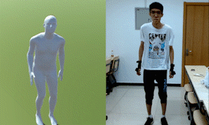

# 课题背景

虚拟人制作过程，通过**动作捕捉**技术，获取人物姿态，进而将任务姿态作为**关键帧**插入到动画中，是业界常见的制作方式。
通过动捕数据生成虚拟人姿态的技术，在一定程度上减轻了动画师的设计工作量。由于姿态是从真人演示中提取得到的，姿态均符合真实物理世界的运行规律，该技术能大幅提升虚拟人的**逼真程度**。

但是传统的动捕设备如**惯性传感器（IMU）**，需要真人在**每个关节**穿戴对应设备，在日常生活中难以推广。所以我们转向从**稀疏的惯性传感器**获取数据，期望通过少量的设备收集到的数据，预测人体全身的运动情况。

# 论文解读TransPose: Real-time 3D Human Translation and Pose Estimation with Six Inertial Sensors
## 论文目标
- 论文解决的问题：通过**稀疏惯性传感器**传入的信息，预测人体全部关节的**运动姿态**（关节旋转角和全局平移量）。
- 现有方法存在的问题：  
    a. 信号稀疏 —— 从**局部**信息预测**全局**信息存在难点；  
    b. 传感器输入信息**噪声**较大 —— 对预测结果易产生干扰。  
    
  

关键点：稀疏惯性传感器，实时性

## 论文方法  
- 方法：基于RNN构建神经网络，仅从6个惯性传感器(IMU)实现全身完整的运动捕捉，速度超过90帧/秒。
- 具体细节：对于身体姿态的估计，使用一个多阶段的网络，输入6个IMU数据，预测全身关节点的位置。为获得稳定的全局平移量，论文还提出一种基于支持脚的平滑方法，通过线性插值估计人体位移速度。  

- 算法流程如下：

- **输入**：

- **Loss Function**：  
1. 预测旋转角theta  

2. 预测全局平移速度v：  
计算支撑脚速度：  

网络预测根关节的速度：  

对两个速度进行线性插值：  

## 论文结论
本文提出了一种基于6个惯性传感器的90帧/秒运动捕捉技术，该技术可重建完整的人体运动，包括身体姿态和全局平移等信息。

- **优点：实时性，稀疏性**。该算法不受环境设置(例如固定的摄像机)的限制，能够在较大范围的运动空间内采集动作数据（与光学预测相比），对于黑暗、户外以及遮挡的情况，也能准确还原人体运动信息。
- **不足**：  
    1. 硬件方面。
       1. 惯性传感器是通过磁力计来测量方向，易受到环境磁场的影响。因此，它不能在磁场变化强烈的环境中工作。
       2. 另外传感器是通过无线传输将信号传送到笔记本电脑，传输距离有限，传感器不能距离笔记本电脑太远(论文提到最多10米)。
    2. 软件方面。
       1. 网络存在泛化问题，不能处理与训练数据集大不相同的动作，例如劈叉和其他复杂动作。
       2. 基于支撑脚的优化方法是基于支撑脚在世界坐标空间中没有运动的假设，这对于像滑冰和滑动这样的运动是不成立的，又或者人体在转呼啦圈之类的场景也会失效。

# 论文解读Physical Inertial Poser (PIP): Physics-aware Real-time Human Motion Tracking from Sparse Inertial Sensors

## 论文目标
- 论文解决的问题：通过**稀疏**惯性传感器传入的信息，预测人体全部关节的**运动姿态（旋转角）和全局平移**。
- 现有方法存在的问题：  
    a. 信号稀疏——从**局部**信息预测**全局**信息存在难点；  
    b. 传感器输入信息**噪声**较大——对预测结果易产生干扰。   

## 论文方法  
- 方法：输入6个惯性传感器(IMU)的动捕信息，通过基于RNN的神经网络和物理优化流程，预测实现全身完整的运动状态。
- 具体细节：
- 为此,我们提出PIP,一个新的实时运动捕捉方法以及关节力矩和地面反作用力估计只使用六个IMU(见图1)。算法有两个阶段:1)基于学习的运动估计和2)基于物理的运动优化，它在运动捕捉中利用了人体运动学和动力学。

为了控制角色，以前的方法[21,54,55,80]使用单个PD控制器计算角加速度或关节力矩来重现参考运动。然而，由于特征构型是在局部欧拉角上参数化的，这种方法只关注局部关节旋转的独立控制，可能导致不理想的全局姿态。简单地将局部局部控制应用于关节的全局旋转，会使优化问题是非二次型的，带来较大的计算量。我们发现，在关节位置上施加PD控制器可以约束全局位姿，而仍然保持问题的二次性。为此，我们提出了一个双PD控制器，它包括1)一个控制关节旋转空间局部位姿的旋转控制器和2)一个控制关节位置空间全局位姿的附加位置控制器。

项目地址：https://xinyu-yi.github.io/PIP/

# 总结
|     | TransPose  | PIP  |
|  ----  | ----  | ----  |
| 方法  | 纯神经网络 | 神经网络 + 物理优化 |
| 关键点  | 采用支撑脚的全局速度优化人体的全局速度 | 施加PD控制器可以约束全局位姿，而仍然保持问题的二次性 |
| 优点  | 不受遮挡和低质量光线情况的影响，实时 | 姿态自然稳定，实时 |
| 缺点  | 无法预测物体滑动状态下的姿态 | 无法预测上楼梯等姿态 |

